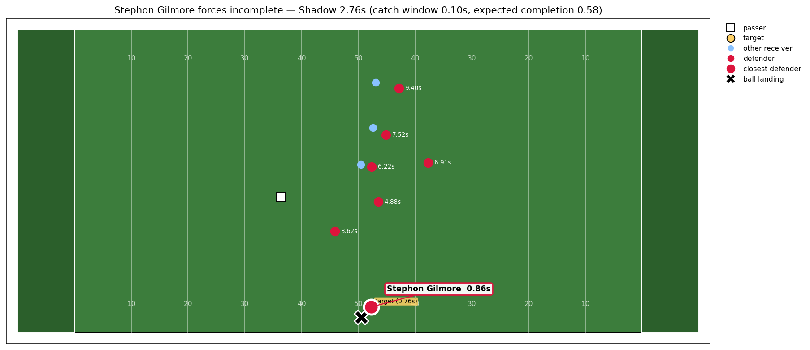
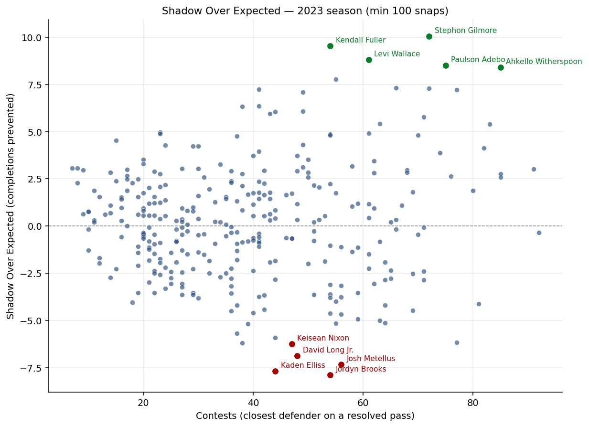
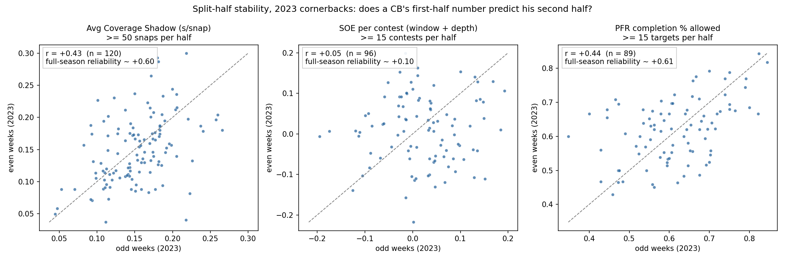
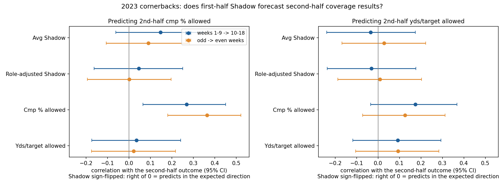

# Coverage Shadow

An NFL player-tracking metric that quantifies how much catch window each defender erases on a pass.

Built on NFL Big Data Bowl 2026 tracking data: the full 2023 regular season. (The
release lists 2024 weeks 14–18 in its supplementary file, but as play outcomes only,
with no tracking, so nothing here is scored for 2024.) Companion to
[Catch Radius Pressure](https://github.com/Stevenmarathias) — CRP measures the receiver's side of the
catch point; Coverage Shadow measures the defense's.

## The idea

At the moment the ball is released, every player is racing to where the ball will land.
Using each player's position, speed and direction, the model estimates their time to reach
the landing spot. The targeted receiver's lead over the fastest-arriving defender is the
**catch window**. A defender's **Shadow** on a play is how much that window would grow if
they were removed from the field — the space they personally took away.

Aggregate over a season and you get a leaderboard of who actually contests throws.

*The play in 2023 where Gilmore contributed the most to his `shadow_won` total: he
arrives 0.86s after release to a target arriving in 0.76s, erasing 2.76s of catch
window from a throw the completion model expected to land 58% of the time.*

*Every defender with 100+ coverage snaps in 2023, plotted by contests (times they
were the closest defender on a resolved pass) versus Shadow Over Expected. Points
above the dashed line beat the completion model's expectation; below it, they gave
up more than expected.*

## 2023 season (v1)

18 weeks, 14,107 plays. Total Shadow is a volume stat that rewards heavily targeted
corners; average Shadow is a per-play rate. Total board uses a 30-snap minimum;
avg board uses 100 to filter small-sample noise.

| # | By total Shadow | Total (s) | Plays | | By avg Shadow (≥100 snaps) | Avg (s) | Plays |
|---|---|---|---|---|---|---|---|
| 1 | Deonte Banks | 87.94 | 333 | | Deonte Banks | 0.26 | 333 |
| 2 | Benjamin St-Juste | 86.92 | 419 | | Josh Jobe | 0.25 | 117 |
| 3 | Ahkello Witherspoon | 86.15 | 443 | | Emmanuel Forbes | 0.23 | 203 |
| 4 | Tyrique Stevenson | 82.28 | 393 | | J.C. Jackson | 0.23 | 221 |
| 5 | Brandon Stephens | 78.14 | 444 | | Tre Avery | 0.23 | 135 |
| 6 | Zyon McCollum | 75.57 | 337 | | Ronald Darby | 0.23 | 189 |
| 7 | Charvarius Ward | 74.28 | 415 | | Darrell Baker Jr. | 0.23 | 186 |
| 8 | D.J. Reed | 72.71 | 329 | | Zyon McCollum | 0.22 | 337 |
| 9 | Michael Davis | 71.48 | 380 | | Montaric Brown | 0.22 | 208 |
| 10 | James Bradberry | 68.36 | 464 | | Shaun Wade | 0.22 | 142 |

## Validation

Does Shadow actually track pass outcomes? Joining `pass_result` from the Big Data Bowl
supplementary file, restricted to completions and incompletions (13,770 plays;
interceptions excluded as a distinct outcome):

- **Top-quartile closest-defender Shadow (≥ 1.03s):** 62.5% completion (n = 3,443)
- **Bottom-quartile closest-defender Shadow (≤ 0.26s):** 75.0% completion (n = 3,443)
- **corr(catch_window, completed) = +0.332**

Passes where the nearest defender erases the most window complete ~12.5 points less often,
and catch window itself is moderately correlated with completion in the expected direction.
v1 is a real signal, not noise.

## 2023 season (v2 — Shadow Over Expected)

v2 grades contests instead of just counting them. Every play with a resolved outcome
gets an **expected completion** from a logistic regression of completion on catch
window (fit across all 13,770 completions/incompletions in 2023:
`P(C) = sigmoid(+0.158 + 1.755 · catch_window)`). A defender's **Shadow Over Expected**
(SOE) on a play is expected completion minus actual completion, so it is measured in
**completions prevented above expectation**: forcing an incompletion when the model
expected 0.9 earns +0.9 comps; giving up a completion when the model expected 0.3
costs 0.7. Summed over the season (closest defender per play, min 100 coverage snaps),
Gilmore's +10.03 means he prevented roughly 10 completions beyond what catch window
alone predicted. The completion model uses catch window as its only feature; the
throw-depth version below is the one to use going forward.

| # | Player | Pos | Plays | Contests | Won (s) | Lost (s) | Win rate | SOE (comps) |
|---|---|---|---|---|---|---|---|---|
| 1 | Stephon Gilmore | CB | 372 | 72 | 24.47 | 34.24 | 41.7% | +10.03 |
| 2 | Kendall Fuller | CB | 402 | 54 | 22.06 | 19.87 | 52.6% | +9.53 |
| 3 | Levi Wallace | CB | 314 | 61 | 29.61 | 27.04 | 52.3% | +8.81 |
| 4 | Paulson Adebo | CB | 379 | 75 | 25.13 | 18.15 | 58.1% | +8.50 |
| 5 | Ahkello Witherspoon | CB | 443 | 85 | 38.54 | 43.24 | 47.1% | +8.40 |
| 6 | Greg Newsome II | CB | 282 | 55 | 25.84 | 16.87 | 60.5% | +7.76 |
| 7 | Devon Witherspoon | CB | 333 | 66 | 22.31 | 35.18 | 38.8% | +7.31 |
| 8 | Zyon McCollum | CB | 337 | 72 | 36.70 | 38.87 | 48.6% | +7.29 |
| 9 | Ja'Sir Taylor | CB | 250 | 41 | 19.51 | 15.19 | 56.2% | +7.23 |
| 10 | Darious Williams | CB | 465 | 77 | 26.33 | 33.23 | 44.2% | +7.21 |

`shadow_won` and `shadow_lost` sum a defender's Shadow (in seconds) across the
incompletions and completions they contested; `win_rate = won / (won + lost)`. Note
how SOE reshuffles the board: Deonte Banks, the v1 volume leader, drops to 19th — he
contests a lot but converts about as often as the geometry would predict.

### Adding throw depth to the completion model

Short passes complete far more often than deep ones at the same catch window, so the
expected-completion model now also takes air yards (`pass_length` in the supplementary
file). Held-out log loss, six folds of three weeks each (`run_expected_model.py`):

| Model | Mean held-out log loss | Better than window-only |
|---|---|---|
| Base rate only | 0.6050 | |
| Catch window (v2 as published) | 0.5354 | |
| **Catch window + air yards** | **0.5217** | 6 of 6 folds, −0.0136 nats |
| + air yards² | 0.5212 | vs linear depth: 3 of 6 folds, −0.0006 |

The bar for adopting it was lower loss in every fold and at least 0.005 nats on
average; depth clears it, and a curved depth term doesn't add anything. Full-season fit:
`logit P(C) = 0.690 + 1.493 · catch_window − 0.411 · (air yards / 10)`.

SOE with and without depth correlates r = 0.96 across the 313 qualified defenders, and 8
of the top 10 stay put:

| # | Window only (v2) | SOE | | Window + air yards | SOE |
|---|---|---|---|---|---|
| 1 | Stephon Gilmore | +10.03 | | Stephon Gilmore | +9.46 |
| 2 | Kendall Fuller | +9.53 | | Greg Newsome II | +8.06 |
| 3 | Levi Wallace | +8.81 | | Levi Wallace | +7.70 |
| 4 | Paulson Adebo | +8.50 | | Devon Witherspoon | +7.69 |
| 5 | Ahkello Witherspoon | +8.40 | | Kendall Fuller | +7.30 |
| 6 | Greg Newsome II | +7.76 | | Kyle Hamilton | +7.05 |
| 7 | Devon Witherspoon | +7.31 | | Paulson Adebo | +6.52 |
| 8 | Zyon McCollum | +7.29 | | Ja'Sir Taylor | +6.51 |
| 9 | Ja'Sir Taylor | +7.23 | | Amik Robertson | +6.12 |
| 10 | Darious Williams | +7.21 | | Zyon McCollum | +6.09 |

But read the next section before reading either SOE board as a ranking of skill.

## Stability

A skill metric has to agree with itself. The test (`run_stability.py`): score every
cornerback on odd weeks and on even weeks of 2023 separately (nine weeks each), and
correlate the two halves. Spearman-Brown turns that half-season correlation into an
estimate of full-season reliability. PFR's charted coverage stats for the same CBs get
exactly the same test, as a benchmark.

| 2023 CBs, odd vs even weeks | Minimum per half | n | Half-season r | Full-season reliability |
|---|---|---|---|---|
| **Avg Coverage Shadow** (per snap) | 50 snaps | 120 | +0.43 | **0.60** |
| **SOE per contest**, window + depth | 15 contests | 96 | +0.05 | **0.10** |
| SOE per contest, window only (v2) | 15 contests | 96 | +0.04 | 0.09 |
| PFR completion % allowed | 15 targets | 89 | +0.44 | 0.61 |
| PFR passer rating allowed | 15 targets | 89 | +0.16 | 0.28 |

(Across all positions, avg Shadow looks even steadier, r = +0.69, but that mostly reflects
linebackers, safeties and corners doing different jobs. The CB-only number is the fair one.)

**Coverage Shadow holds up.** A corner's average Shadow is about as repeatable within a
season as his completion % allowed, and far more so than passer rating allowed. It gets
steadier with volume: half-season r climbs from +0.40 at 25 snaps per half to +0.50 at
100 and +0.62 at 150 (full-season reliability 0.57 → 0.67 → 0.76). It isn't a man/zone
artifact either: a CB's avg Shadow is uncorrelated with how often his team plays man
(r = +0.00).

**Part of that stability is role.** Alignment at the snap is measurable from tracking
frame 1 (`run_role_checks.py`). Slot means inside the widest receiver on his side by
more than a yard; depth is yards off the ball; cushion is distance to the nearest
receiver. Across the 129 CBs with 100+ snaps, alignment alone explains about 30% of the
spread in season avg Shadow (R² 0.31, adjusted 0.29). Slot share does most of it: slot
corners score lower, r = −0.44. Adding scheme (man share, coverage-type mix) takes it to
R² 0.34 (adjusted 0.27), and adding defensive team to 0.50 (adjusted 0.24). With those
controls removed play by play within each half, split-half reliability drops but holds:

| CBs, odd vs even weeks (n = 120) | Half-season r | Full-season reliability |
|---|---|---|
| Raw avg Shadow | +0.43 | 0.60 |
| minus alignment | +0.33 | 0.50 |
| minus alignment + scheme | +0.31 | 0.48 |
| minus alignment + scheme + team | +0.34 | 0.51 |

About a quarter of the reliability was role. The rest is a stable trait of the player
(or of assignments the controls don't capture). One caveat cuts the other way: depth and
cushion are partly the corner's own choice, so controlling for them may remove some skill.

**But first-half Shadow doesn't forecast second-half results.** For 2023 CBs with 50+
snaps and 15+ PFR targets in each half, first-half avg Shadow was used to predict
second-half PFR completion % and yards per target allowed. Shadow's sign is flipped so
that "right direction" is positive for every predictor.

| First half → second half | n | Predictor (1st half) | → cmp % allowed | → yds/target allowed |
|---|---|---|---|---|
| Weeks 1–9 → 10–18 | 90 | Avg Shadow | +0.15 [−0.06, +0.34] | −0.03 [−0.24, +0.17] |
| | | Role-adjusted Shadow | +0.05 | −0.03 |
| | | Cmp % allowed | +0.27 [+0.07, +0.45] | +0.17 [−0.03, +0.37] |
| | | Yds/target allowed | +0.04 | +0.09 |
| Odd → even weeks | 101 | Avg Shadow | +0.09 [−0.11, +0.28] | +0.03 [−0.17, +0.22] |
| | | Role-adjusted Shadow | +0.00 | +0.01 |
| | | Cmp % allowed | +0.36 [+0.18, +0.52] | +0.13 [−0.07, +0.31] |
| | | Yds/target allowed | +0.02 | +0.09 |

First-half completion % allowed is the better forecaster of itself. For comparing
two correlations measured on the same players, the table below uses Meng-Rosenthal-Rubin
tests and a player bootstrap for the 95% interval of the difference:

| Shadow minus cmp % allowed | Weeks 1–9 → 10–18 | Odd → even |
|---|---|---|
| Predicting cmp % allowed | −0.12 [−0.39, +0.15], p = 0.35 | −0.27 [−0.47, −0.06], p = 0.04 |
| Predicting yds/target allowed | −0.21 [−0.48, +0.07], p = 0.12 | −0.10 [−0.36, +0.18], p = 0.47 |

With about 100 corners, only the odd/even completion-% comparison is clearly worse for
Shadow. The others are within noise, but none point Shadow's way. Adding first-half
Shadow to first-half completion % raises the explained share of second-half completion
% by under one percentage point (0.072 → 0.080; 0.132 → 0.135). Yards per target isn't
forecastable by anything here.

Why doesn't a stable metric forecast outcomes? The likeliest answer is that avg Shadow
partly measures **involvement**, not just quality. High-Shadow corners aren't avoided;
they're thrown at more. First-half Shadow correlates +0.23 [+0.04, +0.41] with
second-half PFR targets per coverage snap (+0.20 on odd/even), and +0.34 with how often
the corner is the closest defender to the throw. Being near where the ball goes is a
stable part of a corner's job, especially an outside corner on the other team's top
receiver. It isn't the same thing as making those throws fail.

**SOE does not.** A corner's SOE in odd weeks tells you essentially nothing about his
even weeks (r = +0.05 with throw depth, +0.04 without). Raising the
minimum doesn't rescue it: r is −0.04 to +0.10 from 10 to 30 contests per half, with no
upward trend. The reason is sample size against coin-flip noise. SOE is actual minus
expected completions, and each contest's outcome is close to a coin flip once the
geometry is known. Across CBs with 30+ contests, SOE per contest varies by a standard
deviation of 0.060, while chance alone would produce 0.061. There is no measurable
room left for skill. So SOE boards, including the ones above, mostly rank luck. Gilmore's
+10 completions prevented is a real description of his 2023, not a forecast. SOE should
be read that way until multiple seasons can be pooled, or a player's contests are
weighted by something more stable than the result.

**Across seasons, even the benchmark is weak.** PFR's completion % allowed correlates
only r = +0.18 from 2023 to 2024 for CBs with 30+ targets both years (n = 69; +0.14 for
players on the same team, +0.26 for the 18 who moved). Pooled over every consecutive
pair of seasons 2018–2025 (426 CB pairs), it's r = +0.19; passer rating allowed is
+0.12. Coverage outcomes are noisy from year to year for everyone. The test that would
settle whether Shadow does better, a 2023 → 2024 correlation with team changers split
out, needs 2024 tracking data, which the Big Data Bowl 2026 release doesn't include.

### v3: involvement and effect (pre-registered; both failed)

The involvement finding suggested splitting avg Shadow in two. The definitions and the
pass/fail bar were fixed and committed (`8739a15`, `coverage_shadow/v3.py`,
`run_v3.py`) before any v3 number was computed:

- **Involvement:** share of a corner's coverage snaps on which he is the closest or
  second-closest defender to the landing spot at release.
- **Effect:** his average window reduction on those plays: how much sooner he gets
  there than the next defender behind him. For the closest defender that's exactly his
  v1 Shadow; for the second-closest, it's the window he'd erase if the closest weren't
  there.
- **Bar for effect:** split-half reliability (Spearman-Brown, full season) ≥ 0.40,
  **and**, in both splits (weeks 1–9 → 10–18, odd → even), first-half effect is not
  significantly worse than first-half completion % allowed at predicting second-half
  completion % allowed (Meng-Rosenthal-Rubin two-sided p ≥ 0.05). Involvement faces the
  same bar. CBs only, 50+ snaps and 15+ involved plays per half, 15+ PFR targets per half.

| Component | Split-half r (n = 115) | Full-season reliability | → 2nd-half cmp %, weeks 1–9 → 10–18 (n = 90) | → 2nd-half cmp %, odd → even (n = 101) | Verdict |
|---|---|---|---|---|---|
| **Effect** | +0.12 [−0.06, +0.30] | **0.22** ✗ | +0.18 vs +0.27, p = 0.46 ✓ | +0.16 vs +0.36, p = 0.10 ✓ | **Fail**: not reliable |
| **Involvement** | +0.31 [+0.13, +0.46] | 0.47 ✓ | −0.04 vs +0.27, p = 0.04 ✗ | −0.05 vs +0.36, p < 0.01 ✗ | **Fail**: doesn't predict |
| (avg Shadow, for reference) | +0.45 | 0.62 | +0.15 vs +0.27, p = 0.34 | +0.09 vs +0.36, p = 0.04 | |

In each prediction cell, the first number is the component's correlation with
second-half completion % allowed (sign-flipped, so positive is the right direction) and
the second is first-half completion % allowed's own. The verdict is the same whether
"reliability" means the full-season value or the raw half-season r.

The two halves of Shadow split cleanly into the two failure modes already seen:

- **Effect** is where Shadow's small outcome signal lives. It is Shadow's best forecaster
  of completion % (+0.18 and +0.16) and isn't significantly behind completion % allowed.
  But it is barely repeatable: a corner's window reduction when involved in odd weeks says
  little about his even weeks. Like SOE, it is graded on too few plays per half (median
  46–48 involved plays) to separate skill from noise. Its "not worse" prediction result
  comes with intervals that include zero, so it doesn't rescue it.
- **Involvement** is where Shadow's stability lives, and it carries none of the outcome
  signal: how often a corner is near the throw says nothing about how often those throws
  are completed.

**Involvement explains the target-rate finding.** First-half involvement predicts
second-half targets per coverage snap (+0.25 [+0.06, +0.43] weeks 1–9 → 10–18;
+0.27 [+0.09, +0.43] odd → even). Effect doesn't (+0.00; −0.11). Holding involvement
fixed, avg Shadow's link to target rate drops from +0.23 / +0.20 to +0.10 / +0.10. High-
Shadow corners get thrown at more because they are the corners around the ball, not
because of how well they contest it.

What this means in practice:

- **Avg Coverage Shadow** is a reliable description of how much a corner is around the
  throw. It's as repeatable within a season as completion % allowed, and about three
  quarters of that survives controls for alignment and scheme. It is **not** shown to be
  a coverage-quality metric: it doesn't forecast completion % or yards per target
  allowed, and it forecasts completion % less well than completion % itself.
- **SOE** describes what happened and shouldn't be used to rank defenders by skill
  from one season of data.
- **v3 doesn't fix it.** Splitting Shadow into involvement and effect fails the
  pre-registered bar on both sides. Involvement is stable but says nothing about outcomes;
  effect has a hint of outcome signal but isn't reliable in one season.
- **Still unknown:** whether effect becomes reliable with more data, which needs more
  than one season of tracking. Pooling 2023 with a second season would roughly double
  each corner's involved plays; by Spearman-Brown that would take effect's reliability
  from 0.22 to about 0.36, still short of 0.40. Also whether avg Shadow persists across
  seasons and team changes.

## Run it

    pip install -r requirements.txt
    python run.py data/raw/input_2023_w01.csv                    # one week
    python run_season.py <folder_with_input_csvs> 2023           # full season, v1 + v2
    python run_expected_model.py <folder_with_input_csvs> 2023   # throw-depth test
    python run_stability.py <folder_with_input_csvs> 2023        # split-half + PFR benchmark
    python run_role_checks.py <folder_with_input_csvs> 2023      # role controls + predictive validity
    python run_v3.py <folder_with_input_csvs> 2023               # involvement / effect vs the v3 bar

Outputs land in `outputs/` as play-level scores and leaderboards; `run_stability.py`
and `run_role_checks.py` download the public nflverse PFR, roster and player-ID files
they benchmark against into `data/raw/nflverse/`.

## Limitations

Even v2 uses only the release-frame snapshot: the ball hasn't left the QB's hand yet
in the model's view of the world, so a tight-window completion and a tight-window PBU
still look identical at scoring time. v2 also gives all credit to the single closest
defender; a second defender closing hard gets nothing. Both are on the roadmap. SOE
is not stable within a season (see Stability), and only one season of tracking is
available, so nothing here is tested across seasons yet.

## Roadmap

- **v1 (done):** closing-time model; only the closest-arriving defender earns credit
- **v2 (done):** outcome-aware Shadow — win/loss splits and Shadow Over Expected
- **v3 (tested, failed its pre-registered bar):** involvement / effect split; the effect
  side gives second-closest defenders partial credit, but it isn't reliable in one season
- **v4:** ball-in-the-air extension — how the window collapses frame by frame
- **Visuals:** field heatmaps of each defender's shadow

## Data & license

Tracking data is from the NFL Big Data Bowl 2026 on Kaggle, licensed CC BY-NC 4.0.
Raw data is not committed; see `data/README.md`. This project is non-commercial.
